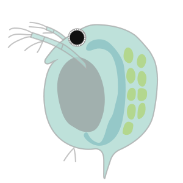

  

<h1 align="center">Daphnia Coding Protocol</h1>

  
  
  
  
  
  
  
  

by <a href="https://github.com/chaerheeon">@chaerheeon</a>

---

## Quick Start
1. [**Open the app.**](https://daphnia-coding-protocol.streamlit.app/) 
   - Check the **Last refresh (KST)** line under the subtitle. **Make sure it's today's date**.
     - Notify the supervisor to update.
   - Any data modified after 12:00 AM of each day will not be accounted for.
2. **Enter a MotherID** in the first box:
   - You can paste a **core** (e.g., `E.1`, `E.1.3`, `A2`, `B.3`) or a **full** ID (e.g., `E.1_0804`, `E.1.3_0912`).
3. **Date suffix** defaults to **today (KST)** as `_MMDD`. 
   - Change it if needed; if left blank, today’s date is applied automatically.
4. Click outside the field (or press Enter) to see:
   - **Suggested Child ID** (with the date suffix),
   - **Discard?** (**Yes** in red or **No**),
   - A short reason explaining the decision.
5. (Optional) Expand **Parent details** and **Existing children** for context.

---

## What You Can Type (Input Normalization)
- The app accepts old and mixed formats and normalizes to dotted **core** form.
- Examples:

  | You type                     | Interpreted core |
  |-----------------------------|------------------|
  | `E1` / `e1` / `E.01`        | `E.1`            |
  | `E1.2` / `E.1.02`           | `E.1.2`          |
  | `E.1_0804`                  | core `E.1`, date `_0804` |
  | `A2` / `A.2`                | `A.2`            |
  | `B3.1_0912`                 | core `B.3.1`, date `_0912` |

- If you enter **core-only** (e.g., `E.1`), the app looks up the **latest** record for that core by numeric date suffix.
- The **Suggested Child ID** always includes a date: your input suffix or (if empty) **today (KST)**.
